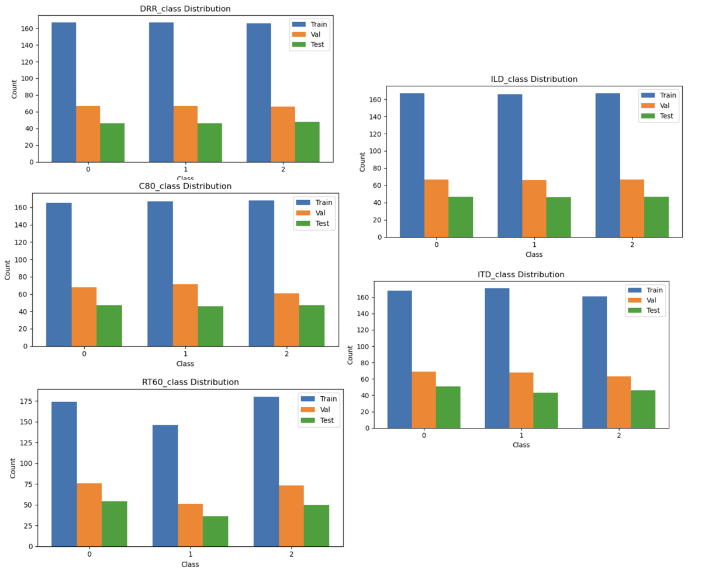
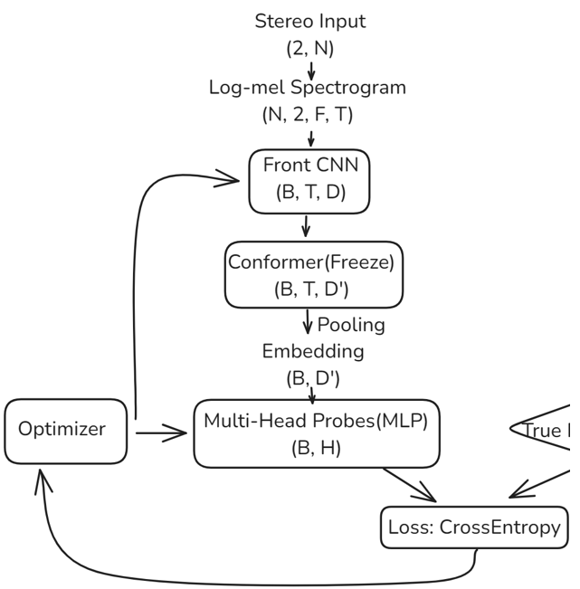
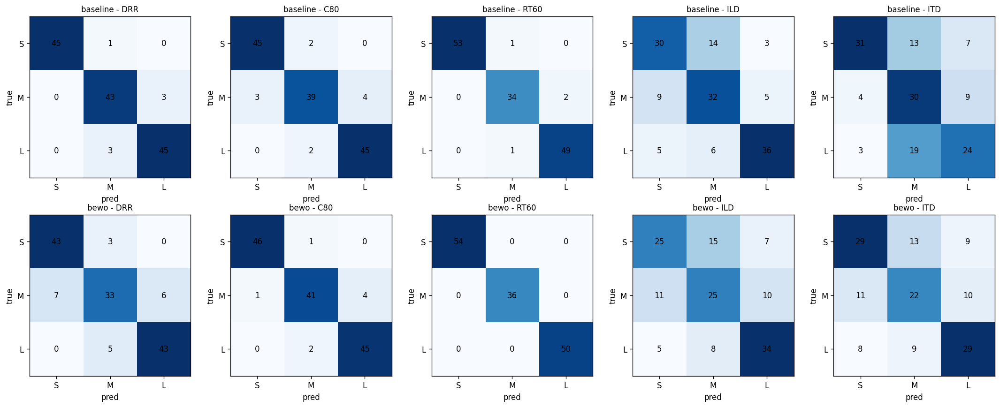
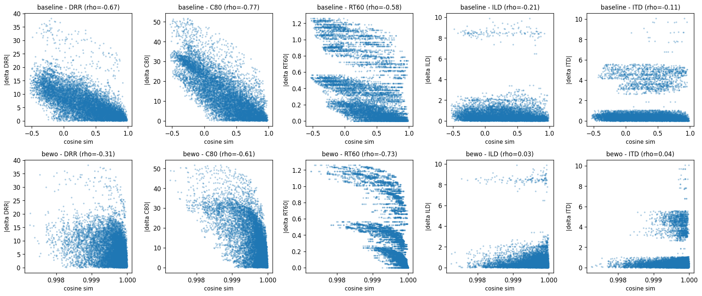
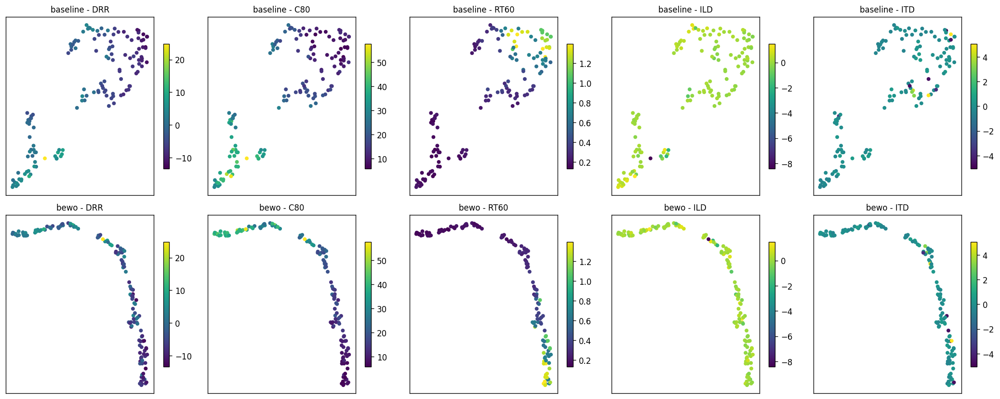

# DL_RIR_AousticAnalysis

This project focuses on **acoustic information representation in Room Impulse Responses / Binaural Room Impulse Responses (RIR / BRIR)**. The core question is: do embeddings from deep audio models actually preserve room-acoustic and spatial cues? If so, which types of information can be recovered by simple downstream probes, and which types are already lost at the input-representation stage?

The project starts from synthetically generated binaural room impulse responses, builds left/right two-channel audio inputs, extracts log-mel spectrograms as the model representation, and performs multi-task modeling and representation analysis around five targets:

- **DRR**: Direct-to-Reverberant Ratio, which measures the ratio between direct sound and reverberant sound and can be used for distance/reverberation analysis.
- **C80**: Clarity Index, which measures the ratio between early reflections and late reverberation and reflects perceived sound clarity.
- **RT60**: Reverberation Time, which describes the decay time of room reverberation.
- **ILD**: Interaural Level Difference, the level difference between the left and right ears, which is an important spatial localization cue.
- **ITD**: Interaural Time Difference, the arrival-time difference between the left and right ears, which is a finer-grained spatial localization cue.

## Project Idea

### 1. Data Generation and Representation

The dataset is generated with `pyroomacoustics` to simulate room-acoustic propagation and produce binaural BRIR audio. Each sample contains a left-ear and a right-ear channel. Log-mel spectrograms are then computed separately for the two channels and combined into a two-channel representation over the time-frequency domain.

The continuous acoustic parameters are further converted into three relatively balanced classes for multi-task classification. The final dataset split is:

- train: 500 samples
- validation: 200 samples
- test: 140 samples

This setup allows the models to learn conventional room-acoustic attributes (DRR, C80, RT60), while also testing whether they can capture binaural spatial cues (ILD, ITD).

### 2. Baseline: Conformer Representation

The baseline uses Conformer as a general-purpose audio modeling architecture. The front-end CNN contains four convolution layers, which compress information across channels and mel bins while preserving temporal information. The Conformer then combines the global modeling ability of Transformer layers with the local temporal modeling ability of CNN layers to produce audio embeddings. Finally, five classification heads are attached to predict DRR, C80, RT60, ILD, and ITD separately.

During training, the main body of the pre-trained Conformer (`speechbrain/asr-conformersmall`) is frozen, and only the front-end CNN and task-specific classification heads are trained. The goal is to observe how much acoustic information a general audio architecture can capture on this task, rather than simply optimizing for end-to-end overfitting.

### 3. BEWO: Spatial Audio Representation

The BEWO part uses a more spatial-audio-oriented CNN/ResNet-style backbone, compressing the binaural input into a 512-dimensional acoustic fingerprint. The focus here is to probe whether a pre-trained or spatially oriented embedding is more capable of encoding binaural spatial information than the general Conformer baseline.

The training strategy also follows the idea of a linear probe / frozen backbone: the backbone representation is preserved as much as possible, and only task-related classification heads are updated. This reduces overfitting on the small dataset and makes the comparison focus more directly on the embeddings themselves.

### 4. Representation Analysis

The project does not only evaluate training accuracy. Instead, it compares the Conformer and BEWO embeddings using three probes:

1. **Decodability**: Logistic Regression / Ridge models are trained to predict the five targets from embeddings, testing whether the information is linearly recoverable.
2. **Similarity**: Cosine similarity is computed between pairs of test embeddings and correlated with ground-truth parameter differences. If an embedding encodes a target, larger parameter differences should correspond to lower embedding similarity.
3. **Visualization**: UMAP is used to project embeddings into two dimensions, allowing us to inspect whether different acoustic parameters form continuous structures in the embedding space.

## Main Results

### Linear Decoding Results

On the test set, both encoders perform well on DRR, C80, and RT60. This suggests that room-acoustic information related to energy, clarity, and reverberation decay can be recovered from the embeddings.

| Target | Conformer Acc. | BEWO Acc. | Observation |
| --- | ---: | ---: | --- |
| DRR | 95.0% | 85.0% | Relatively easy to decode for both encoders |
| C80 | 92.1% | 94.3% | Stable performance for both encoders |
| RT60 | 97.1% | 100.0% | One of the clearest decodable targets |
| ILD | 70.0% | 60.0% | Clearly weaker than the first three acoustic targets |
| ITD | 60.7% | 57.1% | Falls into the harder-to-decode range |

The regression probe shows a similar pattern: DRR, C80, and RT60 obtain relatively high R^2 scores, while ILD/ITD have very low or even negative R^2 values. This indicates that the spatial cues do not enter the embeddings in a stable and recoverable way.

### Similarity Probe

The Spearman correlation between embedding similarity and ground-truth parameter differences shows:

- DRR, C80, and RT60 show clear negative correlations, meaning embedding distance is meaningfully related to these acoustic parameters.
- ILD and ITD have correlations close to 0, meaning the embedding space does not form a stable structure along these binaural spatial cues.

This is consistent with the linear-probe results: the models do learn part of the room-acoustic information, but they do not reliably capture true spatial information that depends on interaural phase or timing differences.

### UMAP Visualization

The UMAP visualization further supports the same finding. For RT60, both encoders show a relatively clear color gradient in the two-dimensional projection, indicating that the embeddings contain a direction related to reverberation time. In contrast, the color distributions for ILD and ITD are scattered and do not form clear continuous structures.

## Conclusion

The main conclusion of this project is: **the current log-mel-spectrogram-based input representation allows models to learn magnitude-side acoustic information such as DRR, C80, and RT60, but it struggles to preserve spatial information such as ILD and ITD, which truly depends on binaural timing and phase differences.**

Therefore, the bottleneck is not necessarily model capacity. Although Conformer and BEWO have different architectures and embedding dimensions, they show a similar failure pattern on ILD/ITD. A more likely reason is that per-channel log-mel spectrogram computation weakens or discards phase information and microsecond-level arrival-time differences, making it impossible for downstream models to recover these spatial cues even with a more complex backbone.

In other words, the answer to the opening question is:

> Both general audio models and spatially oriented models can encode part of the room-acoustic information; however, if the input representation itself loses binaural phase and timing differences, the model will struggle to reliably encode true spatial information.

Future improvements should focus more on the input representation, such as preserving waveform, phase, cross-channel correlation, interaural phase difference, and related features, rather than only replacing the backbone with a larger model.

## File Structure

- `dataset/`: binaural audio, acoustic labels, and train/validation/test splits.
- `baseline_model/`: Conformer baseline, front-end CNN, training notebook, and embedding extraction logic.
- `baseline_outcome/`: embeddings and labels extracted from the baseline model.
- `bewo_model/`: BEWO-style backbone and data preprocessing.
- `bewo_outcome/`: BEWO checkpoint, embeddings, and labels.
- `analysis/`: notebooks and result figures for decodability, similarity, and UMAP analyses.
- `DL4M Final Presentation.pptx`: final project presentation slides.

## Work Division

- Data generation and preprocessing: Yixuan Xu
- Baseline reconstruction and training: Xiaoyi Xu
- BEWO reconstruction and training: Junyi Zhan
- Results analysis: Gavin Zhang
